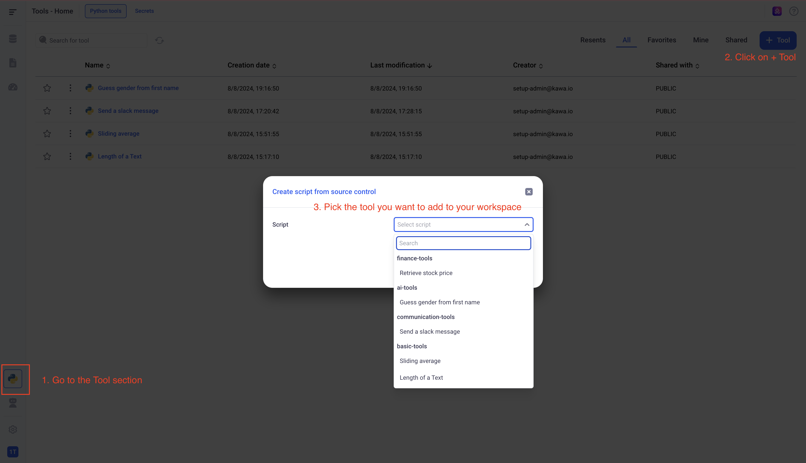

# Kawa Python Scripts

## 1. Connect your workspace to GitHub

### 1.a Generate your personal access token

In order to connect your KAWA workspace to GitHub, you need to generate a Personal access token.
This can be done from the settings menu of your profile.
Go to: `developer settings > Tokens (classic)`

To access public repositories, make sure to set this scope: `public_repo`


### 1.b Set up the connection between KAWA and GitHub

From KAWA, click on the settings icon (cog) at the bottom left of your screen.
Then click on `Source Control`.
There, you can fill the following values:

- Source control type: GitHub
- API Endpoint: If you are using the public Github servers, leave it to: https://api.github.com/. Otherwise use the URL to your company's repository.
- Access Token: Input the token you generated on the previous step
- Repo Name: You can put the entire URL of your repo: for example: https://github.com/kawa-analytics/kawa-toolkits. You can also specify the repository name by itself: `kawa-analytics/kawa-toolkits`.
- Branch Name: This is the name of the branch that KAWA will retrieve the scripts from. for example: `main`


## 2. Create toolkits and tools

In order for KAWA to execute your scripts, you have to declare them as KAWA tools, 
inside KAWA toolkits.

## 2.a Dependencies

For KAWA to execute your scripts with the correct dependencies, make sure to 
create a `requirements.txt` file at the root of your repository.

You need to add a dependency to the kywy library (https://pypi.org/project/kywy/)


## 2.b Kawa tools

In order to declare a method as a Kawa tool, just add the following decorator:
```python
from kywy.client.kawa_decorators import kawa_tool

@kawa_tool
def your_function():
    ...
```

The decorator has several attributes:
- inputs
- outputs
- secrets
- parameters

Please look at the script below for reference:
```python
from kywy.client.kawa_decorators import kawa_tool
import pandas as pd

@kawa_tool(
    inputs={'name': str},
    outputs={'gender': str},
    secrets={'open_ai_key': 'OPEN_AI_KEY'},
    parameters={
        'threshold': {'type': float, 'default': 1.0},
        'satus': {'type': str, 'default': 'PENDING', 'values': ['PENDING','DONE', 'ERROR']}
    },
)
def execute(df: pd.DataFrame, threshold: float, status:str, open_ai_key: str) -> pd.DataFrame:
    open_ai_client = get_open_ai_client(open_ai_key)
    df['gender'] = df['name'].apply(lambda x: guess_gender(open_ai_client, x))
    return df


def get_open_ai_client(open_ai_key: str):
    return f'Some client, authenticated with {open_ai_key}'


def guess_gender(open_ai_client, name: str):
    return f'The guess using {open_ai_client} and {name}'
```
    
#### i. Inputs

Inputs determine what columns the input dataframe of 
your decorated function will receive.
In the above example, the `execute` function will get a dataframe with the column
`name` which will be a string (`str`).

For inputs, the following types are supported:

- str
- float
- bool
- datetime.date
- datetime.datetime

The dataframe usually has additional columns than just the inputs. 
Those will be the primary keys of the sheet or the view you are working on.

#### ii. Outputs

Similarly to Inputs, Outputs will determine the columns of your output dataframe.
Your decorated function MUST return a dataframe with the declared outputs, of the
correct type.
In this example, we declare one output, a string, called: `gender`.

Your returned object must have all the columns of the input dataframe plus the
new generated columns (This will let KAWA inject the generated data in the
original one).

Outputs support the same types as inputs.

#### iii. Secrets

Secrets will be declared in KAWA and stored as encrypted texts.
In the above example, KAWA will have a secret called `OPEN_AI_KEY`.
It will be made available in the script as `open_ai_key`.

#### iv. Parameters (Available from v1.28)

Parameters will be set at runtime by users.
You can declare a list of parameters in the `@kawa_tool` decorator.
For each one, specify its name, its type (Same type as the @input) and a default value.
You can define a list of possible value for text parameters.

Here is a sample of code to illustrate all available types of parameters:

```python
parameters={
                'decimal_param': {
                    'type':float, 
                    'default': 1.0
                },
                'date_param': {
                    'type':datetime.date, 
                    # Default value for date should be 
                    # a string in the ISO format
                    'default': '2020-01-01'
                }, 
                'datetime_param': {
                    'type':datetime.datetime, 
                     # Default value for date time should be 
                     # a string in the ISO format
                    'default': '2000-01-01T01:30:00.000-05:00'
                },
                'boolean_param': {
                    'type':bool, 
                    'default': True
                },
                'text_param': {
                    'type':str, 
                    'default': 'default'
                },
                'text_param_with_values': {
                    'type':str, 
                    'default': 'default',
                    'values': ['OK','KO'],
                }
    }
```

All parameters declared in the decorators should be passed as argument to the main function.

For example:

```python
@kawa_tool(...)
def main(df: pd.DataFrame, 
         decimal_param: float, 
         date_param: datetime.date,
         datetime_param: datetime.datetime, 
         boolean_param: bool, 
         text_param: str,
         text_param_with_values: str,
):
    ...
```


## 2.b Kawa toolkits

Kawa Toolkits are yaml files that list tools with a readable display name and the 
path to the associated scripts.
The toolkit files must be called: `kawa-toolkit.yaml`. (The name is important)

Here is an example of a valid toolkit. It points to a script called `gender.py`.
It will be displayed in Kawa Gui with the name *Guess gender from the  first name*.

```yaml
name: ai-tools
tools:
  - name: Guess gender from first name
    file: gender.py
```

## 2.c Add tools in your workspace

<p align="center">
  
</p>
